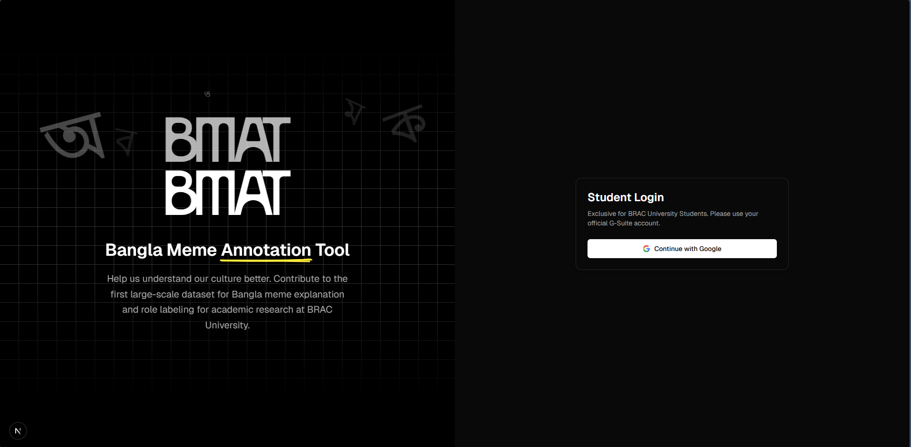
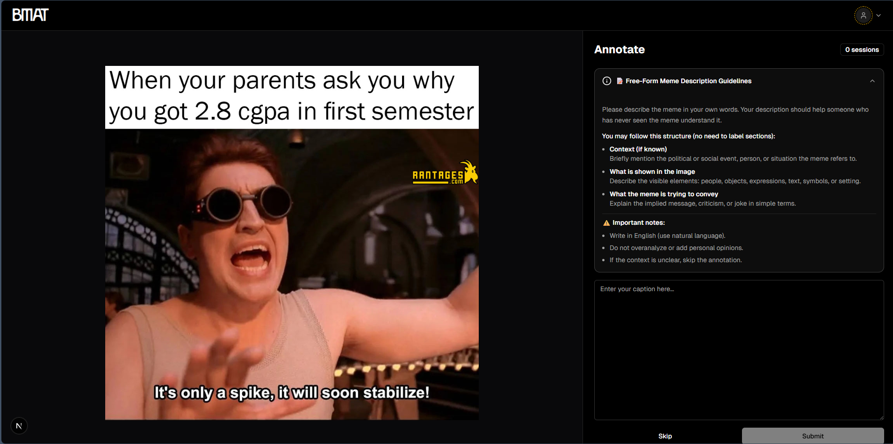
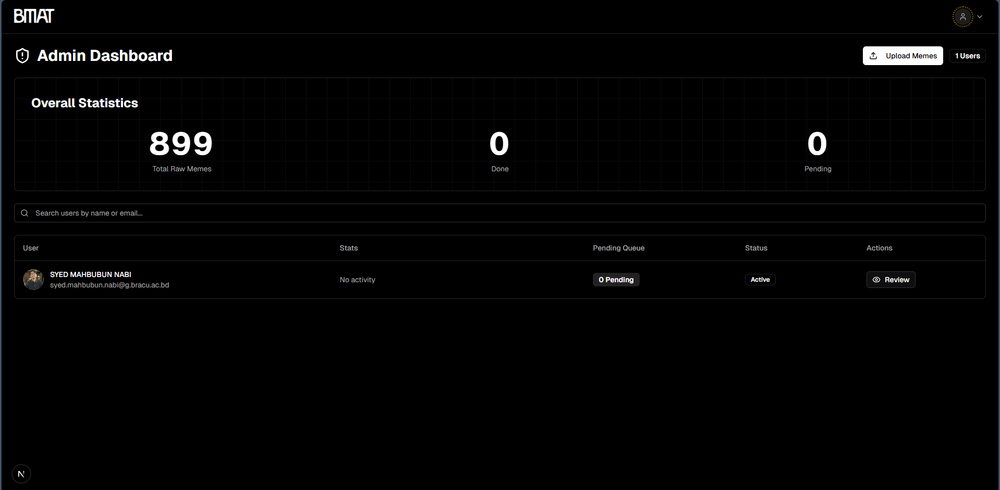

# BMAT

**Bangla Meme Annotation Tool** - A web application for annotating Bangla memes, developed for academic research at BRAC University.

## About

BMAT enables students and researchers to contribute to the first large-scale dataset for Bangla meme explanation and role labeling. Users can annotate memes with captions, helping build a comprehensive dataset for academic research.

## Features

- **Meme Annotation**: View and annotate Bangla memes with descriptive captions.
- **User Dashboard**: Track your annotation progress and history
- **Admin Panel**: Manage users, review annotations, and upload new memes
- **Secure Access**: Google OAuth authentication for BRAC University students

## Screenshots

### Home Page



### Annotation Interface



### Admin Dashboard



## Tech Stack

- **Framework**: Next.js 16
- **Database**: Supabase (PostgreSQL)
- **Authentication**: Supabase Auth (Google OAuth)
- **Styling**: Tailwind CSS
- **Language**: TypeScript

## Getting Started

1. Install dependencies:

```bash
npm install
```

2. Set up environment variables:

```bash
NEXT_PUBLIC_SUPABASE_URL=your_supabase_url
NEXT_PUBLIC_SUPABASE_ANON_KEY=your_supabase_anon_key
SUPABASE_SERVICE_ROLE_KEY=your_service_role_key
ADMIN_EMAILS=admin@bracu.ac.bd,sub...@bracu.ac.bd
```

3. Run the development server:

```bash
npm run dev
```

4. Open [http://localhost:3000](http://localhost:3000) in your browser.

## License

Developed for academic research purposes at BRAC University.
